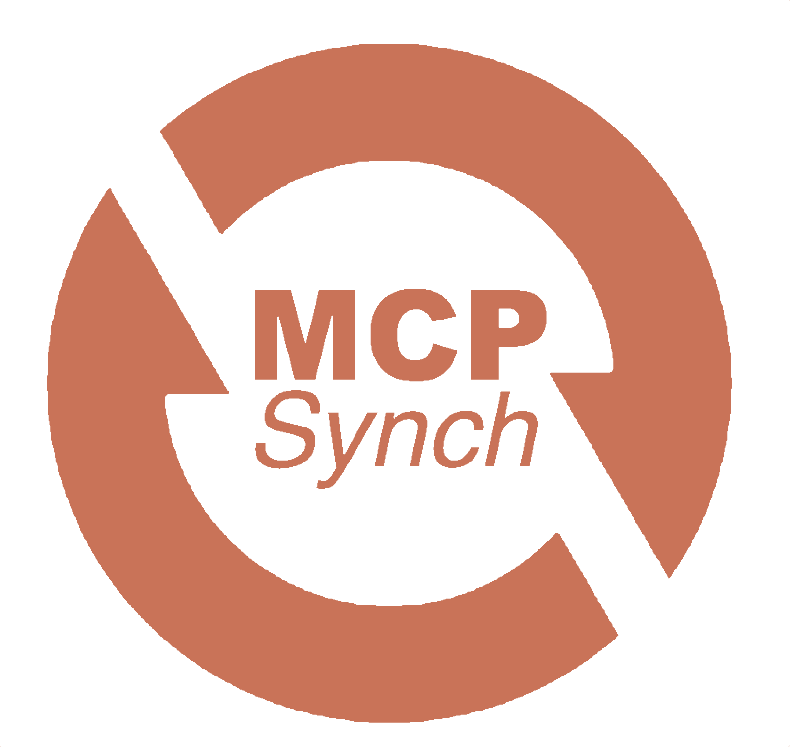
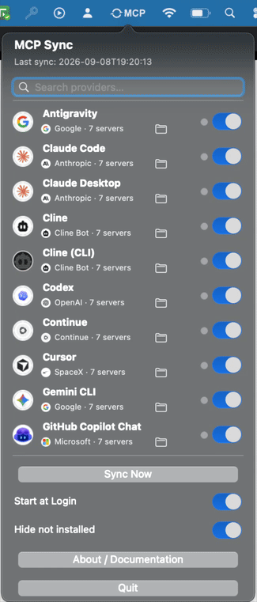

<table width="100%">
<tr>
<td width="20%"></td>
<td width="100%"><h1 align="left"> Sincronização MCP completa</h1></td>
</tr>
</table>

Um aplicativo leve, sempre ativo, que fica na **barra de menu / bandeja do
sistema** e mantém a configuração dos seus **servidores MCP (Model Context
Protocol)** sincronizada entre todas as ferramentas de IA instaladas na sua
máquina — Codex, Claude Code, Cursor, Gemini CLI, GitHub Copilot CLI, VS Code,
OpenCode, Windsurf, Antigravity, Zed, Continue, Roo Code, Claude Desktop,
Cline, Kilo Code, Zoo Code, Amp, Kiro, Amazon Q, Goose, Warp, Trae, LM Studio
e Grok.

Funciona em **macOS (Apple Silicon e Intel), Ubuntu/Linux e Windows**.


[](LICENSE)  
[](https://www.linkedin.com/in/alyssonjalles)
[](https://github.com/AlyssonJalles)


### A interface
<table width="100%">
<tr>
<td width="26%"></td>
<td width="40%"></td>
</tr>
</table>

## Instalação

### macOS / Linux — instalar direto do GitHub (sem clonar o repositório)

```bash
curl -fsSL https://raw.githubusercontent.com/AlyssonJalles/mcp-auto-synch/main/installers/install.sh | bash
```

Isso baixa o último [Release do GitHub](https://github.com/AlyssonJalles/mcp-auto-synch/releases)
e instala — mesmo resultado dos scripts abaixo, sem precisar clonar o repositório.

### macOS (a partir de um clone local)

```bash
./installers/install_macos.sh
```

### Ubuntu / Linux (a partir de um clone local)

```bash
./installers/install_linux.sh
```

Requer bandeja do sistema / AppIndicator (habilitado por padrão no GNOME do
Ubuntu). Se o ícone não aparecer, veja a mensagem que o instalador imprime
sobre o pacote `gir1.2-ayatana-appindicator3-0.1`.

### Windows

No PowerShell:

```powershell
powershell -ExecutionPolicy Bypass -File installers\install_windows.ps1
```

Cada instalador cria um ambiente virtual Python isolado em
`~/.mcp-sync/venv` (mantendo o app leve e sem misturar com o Python do
sistema), registra o app para iniciar no login e já inicia ele na hora.

**Para desinstalar**: rode o script `installers/uninstall_*` correspondente ao
seu sistema operacional.

## Abrindo o app

O instalador já inicia o app na hora e o registra para começar
automaticamente em todo login, então na maior parte do tempo não há nada para
rodar. Se ele não estiver em execução no momento, veja como iniciá-lo de novo:

**macOS**
```bash
launchctl load -w ~/Library/LaunchAgents/com.mcpsync.app.plist
```

**Linux**
```bash
~/.mcp-sync/venv/bin/python3 -m mcp_sync.app &
```

**Windows**
```powershell
& "$env:USERPROFILE\.mcp-sync\venv\Scripts\MCP Sync.exe" -m mcp_sync.app
```

É um app de barra de menu / bandeja do sistema, não uma janela — depois de
iniciado, procure o ícone na barra de menu (macOS) ou na bandeja do sistema
(Windows/Linux).

**No macOS**, o instalador também cria um atalho em `/Applications/MCP Sync.app`
(um link simbólico para o bundle real dentro de `~/.mcp-sync`, com o mesmo
ícone mostrado no Monitor de Atividade), então o app também aparece no
Launchpad e no Spotlight.

## Por que existe

Cada uma dessas ferramentas guarda sua própria lista de servidores MCP em um
arquivo de configuração próprio, com um formato próprio. Se você adiciona um
servidor MCP em uma ferramenta, ele simplesmente não existe nas outras. O MCP
Sync observa todos esses arquivos, junta os servidores encontrados e escreve o
conjunto combinado de volta em cada ferramenta — no formato nativo dela — então
você só precisa cadastrar um servidor uma única vez.

## Como é na prática

Um pequeno ícone "MCP" fica na barra de menu (macOS) / bandeja do sistema
(Windows, Linux), ficando verde enquanto uma sincronização roda. Clicar nele
abre uma lista pesquisável de cada ferramenta — logo, empresa, quantidade de
servidores MCP e uma bolinha de status por linha (🟢 sincronizada, ⚪
sincronização pendente, ⚫ desabilitada) — com um interruptor liga/desliga
para cada uma, um botão "Sync Now" e um interruptor "Start at Login".

**No macOS** isso é um painel nativo que fica aberto enquanto você liga/desliga
interruptores ou pesquisa — só fecha com um clique fora dele. **No
Windows/Linux** é o menu de bandeja padrão, que fecha a cada clique como de
costume.

## Como a sincronização funciona

1. Ao iniciar, sempre que um arquivo monitorado muda (detecção instantânea via
   eventos do sistema de arquivos) ou a cada 60 segundos como segurança extra,
   o MCP Sync lê a lista de servidores MCP de cada ferramenta **habilitada** e
   **detectada**.
2. Ele combina todos os servidores em um único conjunto. Se o mesmo nome de
   servidor existir em mais de uma ferramenta com configurações diferentes,
   **o arquivo editado mais recentemente vence** para aquele servidor.
3. Ele escreve o conjunto combinado de volta no arquivo de configuração de cada
   ferramenta habilitada/detectada, traduzido para o formato nativo dela — sem
   tocar em nenhuma outra configuração daquele arquivo (o `inputs` do VS Code,
   outras chaves do Claude, etc. são preservados como estão).
4. Um arquivo só é reescrito se o conteúdo realmente precisar mudar, então isso
   nunca dispara notificações falsas de "arquivo modificado" em outro lugar nem
   sobrecarrega o disco com escritas desnecessárias.

Nada relacionado à sincronização em si é enviado pela rede — o app só lê e
escreve arquivos locais que já existem na sua máquina. A única chamada de
rede que o app faz é a checagem periódica e opcional de atualizações no
GitHub Releases (veja [Atualização automática](#atualização-automática));
ela nunca envia nenhum dos seus dados de servidores MCP para lugar nenhum.

## Backups

Antes de sobrescrever o arquivo de configuração de uma ferramenta, o MCP Sync
pode salvar uma cópia completa dele primeiro — mas só nos dois momentos em que
uma mesclagem ruim seria realmente algo para você corrigir manualmente:

- **Logo após a instalação**, na primeira sincronização feita quando o app
  inicia pela primeira vez.
- **Toda vez que você clica em "Sync Now"** no menu da bandeja / painel.

A sincronização silenciosa a cada 60 segundos e a sincronização instantânea
disparada pelo monitor de arquivos (quando uma ferramenta edita a própria
configuração) **não** criam backups — do contrário essa pasta ficaria cheia
de cópias quase idênticas a cada minuto.

Os backups ficam salvos em:
```
~/.mcp-sync/backups/<data>_<hora>/<nome da ferramenta>/<nome do arquivo original>
```
por exemplo, `~/.mcp-sync/backups/2026-09-08_22-43-09/Cursor/mcp.json`. Todo
arquivo tocado pela mesma sincronização que dispara backup fica na mesma pasta
com timestamp, então sempre dá para saber o que foi sobrescrito junto. Só as
30 pastas de backup mais recentes são mantidas — as mais antigas são apagadas
automaticamente.

## Atualização automática

O MCP Sync checa periodicamente o GitHub Releases deste repositório em busca
de uma versão mais nova — na inicialização, depois a cada 24 horas, e também
quando você clica em "Check for Updates" no menu da bandeja / painel. Essa
checagem é a única coisa que passa pela rede: um único `GET` na API pública
de Releases do GitHub, sem nada sobre seus servidores ou configurações MCP.

Encontrar uma versão nova nunca instala nada sozinho — aparece uma
notificação e um item "Update Now" no menu. Baixar, instalar e reiniciar só
acontecem quando você clica nele. Você também pode:

- **Skip This Version** — ignora só aquele release; você será avisado de
  novo quando uma versão mais nova sair.
- **Desligar "Auto-update"** — desativa a checagem periódica/na
  inicialização por completo. "Check for Updates" continua funcionando
  manualmente mesmo desligado.

## Ferramentas suportadas e caminhos de configuração

Em ordem alfabética. Cada ícone está padronizado em 42×42 para manter a coluna
alinhada (alguns logos de origem não são perfeitamente quadrados, então ficam
levemente esticados para caber).

| Ferramenta | macOS | Linux | Windows |
|---|---|---|---|
| **Amazon Q**<br> | `~/.aws/amazonq/mcp.json` | `~/.aws/amazonq/mcp.json` | `%USERPROFILE%\.aws\amazonq\mcp.json` |
| **Amp**<br> | `~/.config/amp/settings.json` | `~/.config/amp/settings.json` | `%APPDATA%\amp\settings.json` |
| **Antigravity**<br> | `~/.gemini/config/mcp_config.json` | `~/.gemini/config/mcp_config.json` | `%USERPROFILE%\.gemini\config\mcp_config.json` |
| **Claude Code**<br> | `~/.claude.json` | `~/.claude.json` | `%USERPROFILE%\.claude.json` |
| **Claude Desktop**<br> | `~/Library/Application Support/Claude/claude_desktop_config.json` | *(não suportado pelo Claude Desktop no Linux)* | `%APPDATA%\Claude\claude_desktop_config.json` |
| **Cline**<br> | `~/Library/Application Support/Code/User/globalStorage/saoudrizwan.claude-dev/settings/cline_mcp_settings.json` | `~/.config/Code/User/globalStorage/saoudrizwan.claude-dev/settings/cline_mcp_settings.json` | `%APPDATA%\Code\User\globalStorage\saoudrizwan.claude-dev\settings\cline_mcp_settings.json` |
| **Cline (CLI)**<br> | `~/.cline/data/settings/cline_mcp_settings.json` | `~/.cline/data/settings/cline_mcp_settings.json` | `%USERPROFILE%\.cline\data\settings\cline_mcp_settings.json` |
| **Codex**<br> | `~/.codex/config.toml` | `~/.codex/config.toml` | `%USERPROFILE%\.codex\config.toml` |
| **Continue**<br> | `~/.continue/config.json` | `~/.continue/config.json` | `%USERPROFILE%\.continue\config.json` |
| **Cursor**<br> | `~/.cursor/mcp.json` | `~/.cursor/mcp.json` | `%USERPROFILE%\.cursor\mcp.json` |
| **Gemini CLI**<br> | `~/.gemini/settings.json` | `~/.gemini/settings.json` | `%USERPROFILE%\.gemini\settings.json` |
| **GitHub Copilot CLI**<br> | `~/.copilot/mcp-config.json` | `~/.copilot/mcp-config.json` | `%USERPROFILE%\.copilot\mcp-config.json` |
| **Goose**<br> | `~/.config/goose/config.yaml` | `~/.config/goose/config.yaml` | `%APPDATA%\Block\goose\config\config.yaml` |
| **Grok**<br> | `~/.grok/settings.json` | `~/.grok/settings.json` | `%USERPROFILE%\.grok\settings.json` |
| **Kilo Code**<br> | `~/Library/Application Support/Code/User/globalStorage/kilocode.kilo-code/settings/mcp_settings.json` | `~/.config/Code/User/globalStorage/kilocode.kilo-code/settings/mcp_settings.json` | `%APPDATA%\Code\User\globalStorage\kilocode.kilo-code\settings\mcp_settings.json` |
| **Kiro**<br> | `~/.kiro/settings/mcp.json` | `~/.kiro/settings/mcp.json` | `%USERPROFILE%\.kiro\settings\mcp.json` |
| **LM Studio**<br> | `~/.lmstudio/mcp.json` | `~/.lmstudio/mcp.json` | `%USERPROFILE%\.lmstudio\mcp.json` |
| **OpenCode**<br> | `~/.config/opencode/opencode.json` | `~/.config/opencode/opencode.json` | `%LOCALAPPDATA%\opencode\opencode.json` |
| **Roo Code**<br> | `~/Library/Application Support/Code/User/globalStorage/rooveterinaryinc.roo-cline/settings/mcp_settings.json` | `~/.config/Code/User/globalStorage/rooveterinaryinc.roo-cline/settings/mcp_settings.json` | `%APPDATA%\Code\User\globalStorage\rooveterinaryinc.roo-cline\settings\mcp_settings.json` |
| **Trae**<br> | `~/Library/Application Support/Trae/User/mcp.json` | `~/.config/Trae/User/mcp.json` | `%APPDATA%\Trae\User\mcp.json` |
| **Visual Studio Code**<br> | `~/Library/Application Support/Code/User/mcp.json` | `~/.config/Code/User/mcp.json` | `%APPDATA%\Code\User\mcp.json` |
| **Warp**<br> | `~/.warp/.mcp.json` | `~/.warp/.mcp.json` | `%USERPROFILE%\.warp\.mcp.json` |
| **Windsurf**<br> | `~/.codeium/windsurf/mcp_config.json` | `~/.codeium/windsurf/mcp_config.json` | `%USERPROFILE%\.codeium\windsurf\mcp_config.json` |
| **Zed**<br> | `~/.config/zed/settings.json` | `~/.config/zed/settings.json` | `%APPDATA%\Zed\settings.json` |
| **Zoo Code**<br> | `~/Library/Application Support/Code/User/globalStorage/zoocodeorganization.zoo-code/settings/mcp_settings.json` | `~/.config/Code/User/globalStorage/zoocodeorganization.zoo-code/settings/mcp_settings.json` | `%APPDATA%\Code\User\globalStorage\zoocodeorganization.zoo-code\settings\mcp_settings.json` |

> **Nota:** o Firebase Studio não está incluído — a configuração MCP dele
> (`.idx/mcp.json`) é estritamente por projeto, sem um arquivo global/por
> usuário estável para monitorar, então não se encaixa no modelo de
> sincronização por usuário deste app.

Uma ferramenta só aparece como "instalada" quando o MCP Sync encontra prova
real de que ela está mesmo na sua máquina — o arquivo de configuração já
existindo, o binário de linha de comando no seu `PATH`, o pacote `.app` em
Applications ou (no caso de extensões do VS Code, como Continue e Roo Code) a
extensão de fato instalada. Uma pasta de configuração esquecida *não* é prova
suficiente, justamente para evitar que o app trate uma pasta antiga ou não
relacionada como "instalada" e comece a escrever nela. Ferramentas não
detectadas aparecem separadas (ou ficam ocultas via "Hide not installed") e
nunca recebem escrita.

> **Nota sobre Zed e OpenCode:** essas duas usam esquemas de MCP bem
> diferentes (`context_servers` com um objeto `command` aninhado no Zed; um
> mapa `mcp` com tipos `local`/`remote` no OpenCode). O MCP Sync traduz de e
> para esses formatos da melhor forma possível para servidores stdio simples e
> HTTP remotos; confira o resultado se você usa opções avançadas em alguma
> das duas.

> **Nota sobre os logos:** os ícones redondos com anel branco na tabela acima
> (`mcp_sync/assets/logos/readme/`) são **gerados**, não desenhados à mão — são
> o mesmo renderizador de badge circular que o app usa (`logos.get_badge`), só
> chamado em resolução maior. Se você alterar um logo de origem em
> `mcp_sync/assets/logos/`, regenere esta pasta — não edite os PNGs dela à mão:
>
> ```python
> from mcp_sync.logos import get_badge
> get_badge("Kilo Code", size=112).save("mcp_sync/assets/logos/readme/kilo-code.png")
> ```

## Recompilando após alterar o código

Os instaladores fazem uma **instalação normal (por cópia)**, não editável.
Por isso, editar arquivos neste repositório *não* afeta o app que já está
rodando — é preciso reinstalar no ambiente virtual dele e reiniciar:

```bash
# 1. reinstala o pacote no venv do app (rode a partir da raiz do repositório)
~/.mcp-sync/venv/bin/pip install --upgrade .
```

```bash
# 2a. reiniciar — macOS
launchctl unload ~/Library/LaunchAgents/com.mcpsync.app.plist
launchctl load -w ~/Library/LaunchAgents/com.mcpsync.app.plist
```

```bash
# 2b. reiniciar — Linux
pkill -f mcp_sync.app
~/.mcp-sync/venv/bin/python3 -m mcp_sync.app &
```

```powershell
# 2c. reiniciar — Windows (PowerShell)
Get-Process pythonw, "MCP Sync" -ErrorAction SilentlyContinue | Where-Object { $_.Path -like "*mcp-sync*" } | Stop-Process
& "$env:USERPROFILE\.mcp-sync\venv\Scripts\MCP Sync.exe" -m mcp_sync.app
```

No macOS, se você alterou o ícone do app
(`mcp_sync/assets/logos/_mcp_synch.png`) ou qualquer coisa em `autostart.py`,
regenere também o pacote `.app` — é ele que dá ao processo o nome e o ícone que
aparecem no Monitor de Atividade:

```bash
~/.mcp-sync/venv/bin/python3 -c "from mcp_sync import autostart; autostart.enable()"
```

Para confirmar que ele voltou sem problemas:

```bash
ps -p "$(pgrep -f mcp-auto-synch)" -o pid,etime,ucomm   # macOS/Linux
cat /tmp/mcp-sync.err                                   # deve estar vazio
```

> **Nota:** o `last_sync_iso` em `~/.mcp-sync/settings.json` só avança quando
> uma sincronização de fato *reescreve* algum arquivo. Se tudo já está
> sincronizado, é normal o horário continuar parado — isso não indica que o app
> travou.

## Desenvolvimento

Para rodar a partir do código-fonte sem mexer no app instalado, use um venv
separado:

```bash
python3 -m venv .venv && source .venv/bin/activate   # Windows: .venv\Scripts\activate
pip install -e .
python -m mcp_sync.app
```

As preferências do app (quais ferramentas estão desligadas, horário da última
sincronização) ficam em `~/.mcp-sync/settings.json`. Apagar esse arquivo
restaura o app para o estado padrão (todas as ferramentas habilitadas).

Adicionar suporte a uma ferramenta nova está documentado passo a passo,
incluindo os testes a rodar, em
[SKILL_ADD_NEW_PROVIDER.md](SKILL_ADD_NEW_PROVIDER.md).

### Publicando um release

Dar push numa tag dispara o
[.github/workflows/release.yml](.github/workflows/release.yml), que builda o
wheel usando o que estiver em `version` no `pyproject.toml` naquele momento e
publica como um Release no GitHub — ele não incrementa a versão sozinho.
Fluxo correto para cada release futuro:

1. Edite `version = "0.0.2"` no `pyproject.toml`, e atualize
   `_FALLBACK_VERSION` em [`mcp_sync/__init__.py`](mcp_sync/__init__.py) para
   o mesmo valor (commit normal). O fallback não é o que uma instalação
   normal reporta em tempo de execução — isso vem do metadata do pacote
   instalado — mas manter esse valor atualizado evita que ele fique
   desatualizado no caso raro de a leitura do metadata falhar.
2. `git tag v0.0.2 && git push origin v0.0.2`.

## Perguntas frequentes

<details>
<summary>O app modifica algo além da lista de servidores MCP?</summary>

Não. Ele só toca na chave específica de servidores MCP de cada arquivo
(`mcpServers`, `servers`, `mcp_servers`, `context_servers` ou `mcp`,
dependendo da ferramenta) e preserva todo o resto do arquivo.
</details>

<details>
<summary>Preciso configurar os caminhos dos arquivos manualmente?</summary>

Não. O app varre automaticamente o sistema procurando por todas as ferramentas
suportadas e só mostra no menu as que encontrar instaladas.
</details>

<details>
<summary>E se eu não quiser sincronizar uma ferramenta específica?</summary>

Desligue o interruptor dela. Ela deixa de ser lida e escrita até você ligar de
novo — o arquivo dela fica exatamente como estava na última sincronização.
</details>

<details>
<summary>Funciona sem internet?</summary>

A sincronização em si, sim — é 100% local. A única exceção é a checagem
opcional de atualizações no GitHub Releases (veja
[Atualização automática](#atualização-automática)), que pode ser desligada;
a sincronização continua funcionando offline de qualquer forma.
</details>

<details>
<summary>Como eu restauro um arquivo a partir de um backup?</summary>

Encontre a sincronização que você quer em
`~/.mcp-sync/backups/<data>_<hora>/<nome da ferramenta>/` e copie aquele
arquivo de volta para o caminho real de configuração da ferramenta (mostrado
no app ao lado de cada ferramenta, ou na
[tabela abaixo](#ferramentas-suportadas-e-caminhos-de-configuração)). Não há
um botão de restaurar na interface de propósito — copiar o arquivo de volta é
um passo único e explícito, totalmente sob seu controle. Veja
[Backups](#backups) para saber onde eles ficam e quando são criados.
</details>

<details>
<summary>O que acontece se o mesmo nome de servidor existir em duas ferramentas com configurações diferentes?</summary>

Vence a versão do arquivo que foi **modificado mais recentemente**, e essa
versão é escrita em todas as outras ferramentas — as duas não são mescladas
campo a campo. Se não era isso que você queria, edite o servidor na
ferramenta que deve ser a "fonte da verdade" e deixe sincronizar de novo.
</details>

<details>
<summary>Desinstalar o app apaga as configurações dos meus servidores MCP?</summary>

Não. O desinstalador só remove o próprio MCP Sync (seu venv, seu item de
inicialização, seu atalho `.app` no macOS) — ele nunca toca no arquivo de
configuração de nenhuma ferramenta de IA. Seu `~/.mcp-sync/settings.json` e
`~/.mcp-sync/backups/` também são mantidos, caso você reinstale depois.
</details>

<details>
<summary>Posso sincronizar servidores MCP entre vários computadores?</summary>

Não diretamente — o MCP Sync só reconcilia as ferramentas instaladas *na
máquina onde ele está rodando*, e a sincronização em si nunca faz nenhuma
chamada de rede. Se você
quer os mesmos servidores em outra máquina, precisa sincronizar o conjunto de
ferramentas daquela máquina separadamente (ou copiar o arquivo de
configuração de uma ferramenta para lá e deixar o MCP Sync propagar a partir
dele).
</details>

<details>
<summary>Por que uma ferramenta que eu tenho instalada aparece como "não instalada"?</summary>

O MCP Sync exige prova real — o binário de linha de comando no `PATH`, o
pacote `.app`/`.exe`, uma extensão do VS Code de fato presente, ou (para a
maioria das ferramentas) o arquivo de configuração já existindo. Se você
acabou de instalar a ferramenta e ainda não abriu ela, o arquivo de
configuração pode ainda não existir; abra a ferramenta uma vez e depois
clique em "Sync Now".
</details>

<details>
<summary>Como eu impeço o app de iniciar no login?</summary>

Desligue "Start at Login" no menu da bandeja / painel — isso liga/desliga o
item de inicialização automática do sistema operacional (um LaunchAgent no
macOS, um arquivo `.desktop` no Linux, ou uma chave de registro `Run` no
Windows) sem desinstalar nada.
</details>

## Referência de funções

Um mapa em linguagem simples do que cada parte do código faz, para quem quer
ler o código-fonte sem precisar rastrear cada linha.

### `sync_engine.py` — o motor de sincronização

| Função                                   | O que faz                                                                                                                                                                                                                                                                                                                                                                                                                                                                                                                                                                                                                                                                                                                                                                                                 |
| ------------------------------------------ | --------------------------------------------------------------------------------------------------------------------------------------------------------------------------------------------------------------------------------------------------------------------------------------------------------------------------------------------------------------------------------------------------------------------------------------------------------------------------------------------------------------------------------------------------------------------------------------------------------------------------------------------------------------------------------------------------------------------------------------------------------------------------------------------------------- |
| `merge_servers`                          | Pega as listas de servidores de todas as ferramentas habilitadas/detectadas e junta em um único conjunto. Exemplo: o Cursor tem`mcp1, mcp2`, o VS Code tem `mcp3, mcp4`, o Codex tem `mcp5` → o resultado combinado é `{mcp1, mcp2, mcp3, mcp4, mcp5}`. Se o *mesmo nome de servidor* existir em mais de uma ferramenta com configurações diferentes, vence a versão do arquivo que foi **modificado mais recentemente** — a outra é descartada, e não mesclada campo a campo. Ele também recompõe um `type` faltando em servidores remotos a partir da cópia de outra ferramenta, para que um arquivo alterado por motivos alheios (por exemplo, o Claude Code atualizando as próprias estatísticas de uso) não corrompa em silêncio o registro de um servidor remoto. |
| `run_sync`                               | A função que de fato "faz a sincronização". Lê todas as ferramentas, chama`merge_servers`, remove qualquer servidor que tenha sido deliberadamente apagado do arquivo que acabou de mudar (para ele não voltar a partir da cópia de outra ferramenta), escreve o conjunto combinado em toda ferramenta cujo arquivo esteja diferente, e registra o horário da última sincronização. Quando chamada com `backup=True` (sincronização de inicialização, "Sync Now"), ela salva um backup de cada arquivo via `backup.py` antes de sobrescrevê-lo.                                                                                                                                                                                                                                                                                                                                                                                                          |
| `build_statuses`                         | Monta a lista mostrada na interface: para cada ferramenta conhecida, se ela está instalada, habilitada, sincronizada e quantos servidores tem.                                                                                                                                                                                                                                                                                                                                                                                                                                                                                                                                                                                                                                                           |
| `_enabled_detected_tools`                | Filtra a lista completa de ferramentas conhecidas, deixando só as que o usuário não desabilitou*e* que estão realmente instaladas na máquina.                                                                                                                                                                                                                                                                                                                                                                                                                                                                                                                                                                                                                                                      |
| `_safe_read`                             | Lê a lista de servidores de uma ferramenta; se o arquivo estiver faltando ou corrompido, devolve "nenhum servidor" em vez de derrubar o app.                                                                                                                                                                                                                                                                                                                                                                                                                                                                                                                                                                                                                                                             |
| `watched_paths` / `all_registry_paths` | Listam quais caminhos de configuração o monitor de arquivos deve vigiar — o primeiro só para ferramentas instaladas no momento, o segundo para*todas* as conhecidas (assim uma ferramenta recém-instalada é detectada automaticamente).                                                                                                                                                                                                                                                                                                                                                                                                                                                                                                                                                           |
| `seconds_since_last_sync`                | Há quanto tempo a última sincronização terminou — usado para ignorar a escrita do próprio app como um falso evento de "arquivo alterado".                                                                                                                                                                                                                                                                                                                                                                                                                                                                                                                                                                                                                                                           |

### `backup.py` — salvando um backup antes de sobrescrever um arquivo

| Função | O que faz |
|---|---|
| `backup_file` | Copia o arquivo de configuração de uma ferramenta para `~/.mcp-sync/backups/<run_id>/<nome da ferramenta>/` antes de `run_sync` sobrescrevê-lo. Não faz nada se o arquivo ainda não existir. |
| `make_run_id` | Monta o nome de pasta legível e com timestamp (por exemplo, `2026-09-08_22-43-09`) compartilhado por todos os arquivos salvos na mesma sincronização. |
| `prune_old_backups` | Apaga todas as pastas de backup exceto as 30 mais recentes, para a pasta não crescer para sempre. |

### `tools_registry.py` — um "tradutor" por ferramenta

Cada ferramenta guarda seus servidores MCP em um formato e formato de arquivo
diferentes. Este módulo normaliza todos em um formato comum, e de volta.

| Função                                                                                       | O que faz                                                                                                                                                                                                                                                                                                                                                                                                                                                                                       |
| ---------------------------------------------------------------------------------------------- | ----------------------------------------------------------------------------------------------------------------------------------------------------------------------------------------------------------------------------------------------------------------------------------------------------------------------------------------------------------------------------------------------------------------------------------------------------------------------------------------------- |
| `build_registry`                                                                             | Monta o catálogo completo de todas as ferramentas suportadas (Cursor, VS Code, Claude Code, Codex, Zed, Goose, OpenCode, etc.), com o caminho de configuração por sistema operacional, o adapter e como detectar se está instalada.                                                                                                                                                                                                                                                         |
| `ToolSpec.resolved_path`                                                                     | Transforma um modelo de caminho como`~/.cursor/mcp.json` em um caminho real na máquina do usuário atual.                                                                                                                                                                                                                                                                                                                                                                                    |
| `ToolSpec.is_present`                                                                        | Decide se uma ferramenta está genuinamente instalada — procura o binário no`PATH`, o `.app`/`.exe` em Applications, ou a extensão do VS Code — em vez de simplesmente confiar que existe uma pasta de configuração esquecida. É isso que impede o MCP Sync de "adotar" a pasta de uma ferramenta antiga e desinstalada.                                                                                                                                                           |
| `_generic_mcp_servers_key_adapter`                                                           | Adapter usado pela maioria das ferramentas (Claude Code, Cursor, Claude Desktop, Gemini CLI, Continue, Amp, Kiro, Amazon Q, Warp, LM Studio, Grok…), que guardam os servidores da mesma forma, sob uma chave no estilo`mcpServers`.                                                                                                                                                                                                                                                          |
| `_vscode_adapter`                                                                            | O VS Code guarda os servidores em`servers` (e não `mcpServers`) e exige um campo `type` explícito. Este adapter remove o `type` redundante dos servidores locais na leitura, mas o mantém nos remotos — sem ele, o Claude Code descarta esse servidor remoto em silêncio.                                                                                                                                                                                                          |
| `_codex_toml_adapter`                                                                        | Traduz as tabelas TOML`[mcp_servers.<nome>]` do Codex de e para o formato comum.                                                                                                                                                                                                                                                                                                                                                                                                              |
| `_streamable_http_adapter`                                                                   | Usado por Roo Code, Cline, Cline (CLI), Kilo Code e Zoo Code. Eles guardam os servidores igual ao adapter genérico, mas o esquema rígido deles rejeita um servidor remoto cujo`type` seja o `"http"` simples usado no resto deste app — exigem `"streamable-http"` ou `"streamableHttp"` (a grafia exata varia por ferramenta), senão o arquivo de configurações inteiro é rejeitado com "Invalid MCP settings format". Este adapter traduz esse único campo na ida e na volta. |
| `_zed_adapter`                                                                               | O Zed só suporta servidores locais (stdio), em uma estrutura`context_servers` aninhada de forma diferente; servidores remotos são simplesmente ignorados na escrita, já que o Zed não tem como representá-los. Reconstrói a seção inteira a cada escrita, para que um servidor removido em outro lugar também desapareça do Zed.                                                                                                                                                    |
| `_opencode_adapter`                                                                          | O mapa`mcp` do OpenCode usa tipos `local`/`remote` e um único array `command` (executável + argumentos juntos), diferente do formato comum, que mantém os dois separados.                                                                                                                                                                                                                                                                                                            |
| `_goose_adapter`                                                                             | O Goose guarda os servidores em um mapa YAML`extensions`, com nomes de campo próprios (`cmd`, `envs`, `uri`).                                                                                                                                                                                                                                                                                                                                                                          |
| `_read_json`/`_write_json`, `_read_yaml`/`_write_yaml`, `_read_toml`/`_write_toml` | Auxiliares seguros de leitura e escrita: a leitura devolve um resultado vazio em vez de quebrar com um arquivo ausente ou corrompido; a escrita passa antes por um arquivo temporário, para que uma falha no meio do caminho não corrompa a configuração real.                                                                                                                                                                                                                              |

### `settings.py` — as preferências do próprio app

| Função                                   | O que faz                                                                                                                                                                                             |
| ------------------------------------------ | ----------------------------------------------------------------------------------------------------------------------------------------------------------------------------------------------------- |
| `load` / `save`                        | Lê e escreve o arquivo de configurações do próprio MCP Sync (`~/.mcp-sync/settings.json`), sempre mesclado com os padrões, para que um arquivo antigo não quebre depois de uma atualização. |
| `is_tool_enabled` / `set_tool_enabled` | Consulta/define se uma ferramenta específica deve ser sincronizada (o interruptor por ferramenta na interface).                                                                                      |
| `set_start_at_login`                     | Liga ou desliga o "iniciar o MCP Sync no login".                                                                                                                                                      |
| `set_hide_not_installed`                 | Liga ou desliga a ocultação das ferramentas não instaladas na lista da interface.                                                                                                                  |

### `watcher.py` — reagindo a mudanças de arquivo na hora

| Função                                                | O que faz                                                                                                                                                                                                                                                  |
| ------------------------------------------------------- | ---------------------------------------------------------------------------------------------------------------------------------------------------------------------------------------------------------------------------------------------------------- |
| `start` / `stop`                                    | Começa ou para de monitorar o arquivo de configuração de todas as ferramentas conhecidas. Prefere a biblioteca`watchdog`, para reações instantâneas e de baixo consumo de CPU; recorre a verificação periódica se ela não estiver disponível. |
| `_start_watchdog` / `_start_polling`                | As duas implementações: eventos instantâneos do sistema de arquivos vs. checar a data de modificação a cada 5 segundos.                                                                                                                               |
| `_schedule_debounced_sync` / `_flush_pending_paths` | Agrupa várias mudanças rápidas no mesmo arquivo (por exemplo, um editor salvando várias vezes em menos de 1,5s) em uma única sincronização, em vez de disparar uma por escrita.                                                                     |

### `app.py` / `mac_ui.py` — o ícone da bandeja e o painel do macOS

| Função                               | O que faz                                                                                                                                                                                                                |
| -------------------------------------- | ------------------------------------------------------------------------------------------------------------------------------------------------------------------------------------------------------------------------ |
| `main`                               | Ponto de entrada: usa o painel nativo do macOS (`mac_ui.py`) quando disponível, e recorre ao ícone de bandeja multiplataforma (`app.py`) caso contrário.                                                          |
| `run` / `start`                    | Liga o "iniciar no login" se configurado, inicia o monitor de arquivos e a sincronização periódica de 60 segundos, e roda a primeira sincronização.                                                                 |
| `sync_now`                           | Roda uma sincronização e mostra uma notificação se algo mudou ou falhou.                                                                                                                                             |
| `_periodic_sync_loop`                | Sincronização de segurança a cada 60 segundos, mesmo sem nenhuma mudança de arquivo detectada.                                                                                                                       |
| `_on_files_changed`                  | Disparado pelo monitor; sincroniza de novo e (diferente do laço periódico) avisa o usuário se algo de fato mudou.                                                                                                     |
| `_menu_items` / `_rebuild_content` | Montam a lista mostrada no menu da bandeja / painel: uma linha por ferramenta, com bolinha de status (🟢 sincronizada, ⚪ fora de sincronia, ⚫ desabilitada) e a contagem de servidores, por exemplo "Claude Code (5)". |
| `toggleTool_`                        | Trata o clique no interruptor de uma ferramenta: salva a preferência e sincroniza de novo.                                                                                                                              |
| `revealConfig_`                      | Abre o gerenciador de arquivos exatamente no arquivo de configuração daquela ferramenta.                                                                                                                               |
| `openDocumentation_`                 | Abre este repositório no navegador.                                                                                                                                                                                     |

### `autostart.py` — iniciar no login

| Função                                  | O que faz                                                                                                                                                                                                                                 |
| ----------------------------------------- | ----------------------------------------------------------------------------------------------------------------------------------------------------------------------------------------------------------------------------------------- |
| `enable` / `disable` / `is_enabled` | Liga/desliga o "iniciar o MCP Sync no login" ou consulta o estado, delegando para o mecanismo certo de cada sistema: um`.plist` de LaunchAgent no macOS, um arquivo `.desktop` no Linux, ou uma chave de registro `Run` no Windows. |

### Interface e utilitários

| Função                                                                      | O que faz                                                                                                                                                                                    |
| ----------------------------------------------------------------------------- | -------------------------------------------------------------------------------------------------------------------------------------------------------------------------------------------- |
| `group_for_tool` / `get_group` (`groups.py`)                            | Mapeiam uma ferramenta para a empresa que a faz, para agrupar a lista visualmente.                                                                                                           |
| `get_badge` / `get_company_logo` (`logos.py`)                           | Carregam a imagem do logo de uma ferramenta ou empresa, recorrendo a um monograma colorido gerado na hora (por exemplo, "CC" para Claude Code) se não houver arquivo de logo.               |
| `build_icon` / `build_status_dot` (`tray_icon.py`)                      | Desenham o ícone da barra de menu (que fica verde durante a sincronização) e as bolinhas coloridas de status mostradas ao lado de cada ferramenta.                                        |
| `notify` (`notifier.py`)                                                  | Mostra uma notificação nativa do sistema (banner no macOS,`notify-send` no Linux, toast no Windows); nunca lança erro — uma notificação que falha é simplesmente ignorada.          |
| `home` / `expand` / `open_path_in_file_manager` (`platform_utils.py`) | Auxiliares multiplataforma: obter a pasta pessoal, expandir um modelo de caminho como`~/.cursor/mcp.json` em um caminho real, e abrir o gerenciador de arquivos em um arquivo específico. |

## English version

See [README.md](README.md) for this same documentation in English.

## Licença

MIT
